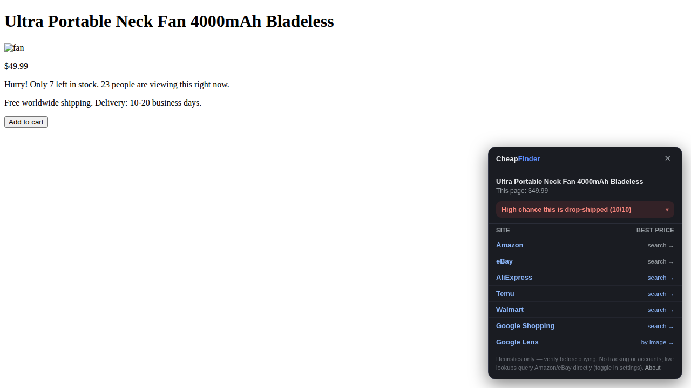

# CheapFinder 💸

Browser extension + bookmarklet that answers two questions on any shop's product page:

1. **Is this likely drop-shipped?** (Shopify + drop-ship apps, AliExpress/Temu-hosted
   images, 10–20 day shipping estimates, fake-urgency widgets, freshly registered
   domains…)
2. **Can I get it cheaper?** One popover with best-effort live prices from Amazon and
   eBay, plus one-tap searches on AliExpress, Temu, Walmart, Google Shopping, and a
   **Google Lens search by the product's image**.

Everything runs locally in your browser. No server, no accounts, no analytics, no
affiliate-link injection. The only network traffic is the optional live-price lookup
(sends the product title to Amazon/eBay and the shop's domain to rdap.org for a
registration-age check) — it's disclosed in the panel footer and can be switched off in
the extension popup.



## Install — desktop (Chrome / Edge / Brave / Arc)

1. Clone or download this repo.
2. Open `chrome://extensions`, enable **Developer mode** (top right).
3. **Load unpacked** → select the `extension/` folder.
4. Visit any product page — the panel opens automatically (configurable via the
   extension's toolbar popup).

The extension deliberately stays off the marketplaces it compares against (Amazon,
eBay, AliExpress, Temu, Walmart, Google) and off payment providers — it isn't broken
there, it's excluded by design.

## Install — phone (iPhone / Android)

Mobile Chrome and Safari don't run extensions, so the phone build is a **bookmarklet**
with the same detection engine (links-only mode — no live price fetch, because pages
block cross-origin requests):

1. Run `npm run build:bookmarklet` (or grab the prebuilt `bookmarklet/install.html`).
2. Open `bookmarklet/install.html` in any browser and follow the steps: copy the code,
   bookmark any page, edit the bookmark, paste as URL.
3. On a product page: open bookmarks → tap **CheapFinder**. Tap again to dismiss.

Tip: install the bookmarklet once on desktop and let Chrome sync / iCloud push it to
your phone. On iOS, Kagi's Orion browser can also load the Chrome extension directly.

## How it works

- **Product detection** — reads the page's own structured data, in order: JSON-LD
  (`schema.org/Product`), OpenGraph product tags, microdata, then a conservative
  URL+`<h1>` heuristic. This is the same markup shops publish for Google, so coverage is
  high and there's no guessing.
- **Drop-ship score (0–10)** — additive signals, each shown to you in the panel (tap the
  verdict to expand): storefront platform, known drop-ship/fulfilment app scripts
  (DSers, Zendrop, CJdropshipping…), product images hosted on `alicdn.com`/`kwcdn.com`,
  long delivery estimates or "ships from overseas warehouse", urgency widgets,
  "free worldwide shipping", and domain age via an RDAP lookup (extension only).
- **Prices** — the extension's background worker does a best-effort fetch of public
  Amazon/eBay search results, filters them by title similarity, and shows the cheapest
  plausible matches; when those sites serve a bot wall it silently degrades to search
  links. AliExpress/Temu are heavily bot-walled, so they're always one-tap search links.
  The Google Lens row searches by the product's main image — usually the fastest way to
  find the identical AliExpress/Temu listing.

## Development

```bash
npm install
npm test                  # unit tests (jsdom): extraction, parsers, heuristics
npx playwright install chromium  # once, unless a Chromium is already available
npm run e2e               # real Chromium: loads the unpacked extension + bookmarklet
npm run build:bookmarklet # regenerate bookmarklet bundle + install page
```

The e2e runner picks a browser in this order: `$CHROMIUM_PATH`, a preinstalled
Playwright Chromium, then Playwright's default resolution. It needs full Chromium
(not the headless shell) because it loads the unpacked extension.

Layout: `extension/shared/` holds the engine (extraction, heuristics, sites, UI) shared
verbatim between the content script and the bookmarklet bundle; `extension/content.js`
and `extension/background.js` are the extension glue; `tools/build-bookmarklet.mjs`
produces `bookmarklet/cheapfinder.js` and `bookmarklet/install.html`.

## Honest limitations

- Live Amazon/eBay prices are **best-effort**: automated fetches of their search pages
  are against their ToS and often bot-walled, so expect the graceful "search →" fallback
  frequently. Fine for personal use; a public release should use the official affiliate
  APIs instead — see [docs/DATA-SOURCES.md](docs/DATA-SOURCES.md) for the full research
  (how Google Lens really gets its data, how Honey did it legally, which APIs offer
  image search, and Chrome Web Store rules post-Honey-scandal).
- The drop-ship score is a heuristic, not proof. A Shopify store with slow shipping can
  be a legitimate small business. The panel always shows *why* it scored what it scored.
- Match quality is keyword-based (plus Lens by image); identical products with wildly
  different titles can slip through — that's what the Lens row is for. Live price
  highlighting only happens for USD page prices, since the live results come from
  amazon.com/ebay.com.
- The bookmarklet runs in the page's own JavaScript world, so a page that patches
  built-ins (`JSON.parse`, array prototypes) can break or fool it. The extension's
  content script runs in an isolated world and doesn't have this weakness.

## License

MIT
